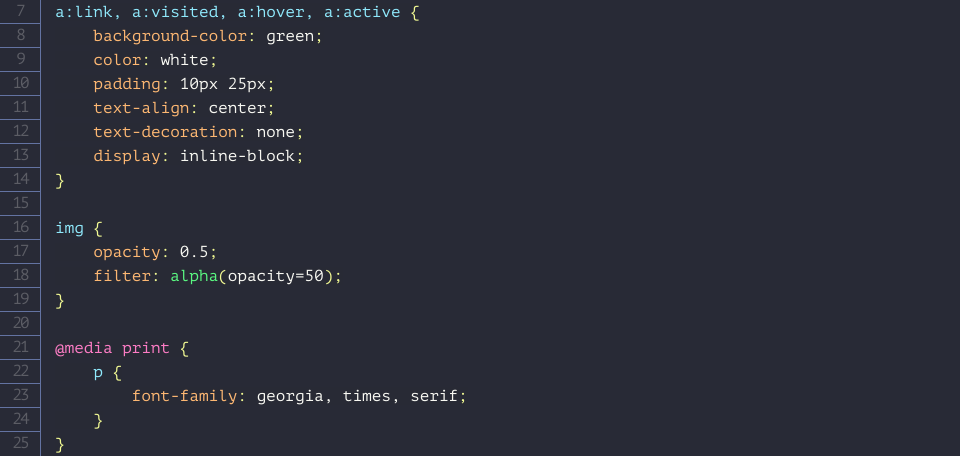
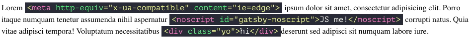
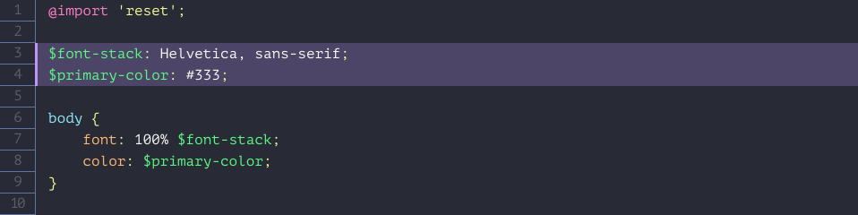
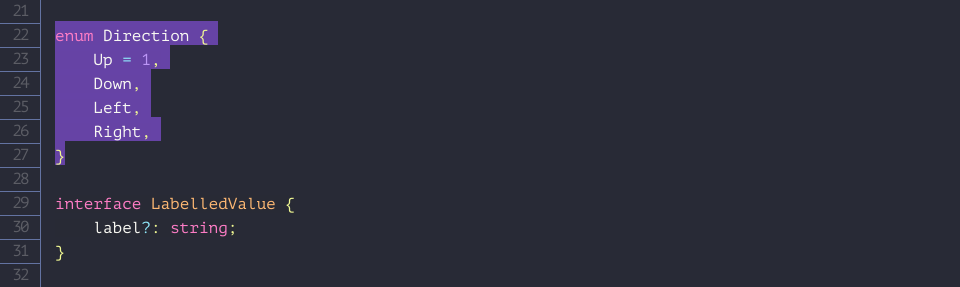

<a href="https://gatsbyjs.org">
	

		
	

</a>

<h1 align="center">
	Dracula syntax highlighting theme for Gatsby
</h1>

<a href="https://draculatheme.com">
	

		
	

</a>

Dark syntax highliting theme for `gatsby-remark-prismjs` plugin with pre-configured line numbers and line highlights.

## Installation

1. Assumed you are using [gatsby-sass](https://www.gatsbyjs.org/packages/gatsby-plugin-sass) and [gatsby-remark-prismjs](https://www.gatsbyjs.org/packages/gatsby-remark-prismjs).
2. `npm install gatsby-syntax-highlight-dracula`
3. `import gatsby-syntax-highlight-dracula` in `gatsby-browser.js`.

* In order to show line numbers add `showLineNumbers: true` in `gatsby-remark-prismjs` config.
* If you don't use [gatsby-plugin-sass](https://www.gatsbyjs.org/packages/gatsby-plugin-sass/) then you have to import `gatsby-syntax-highlight-dracula/lib/styles.css` in `gatsby-browser.js` for step #3.

## Screenshots

### CSS

### Inline code

### Line highlight

### Code Selection

